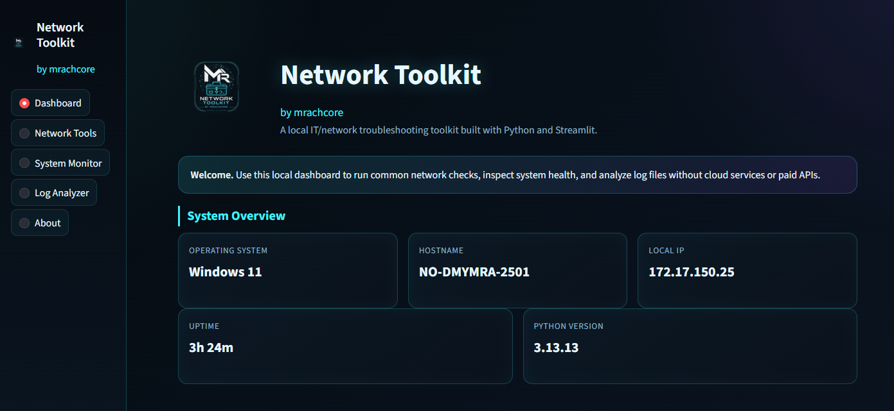
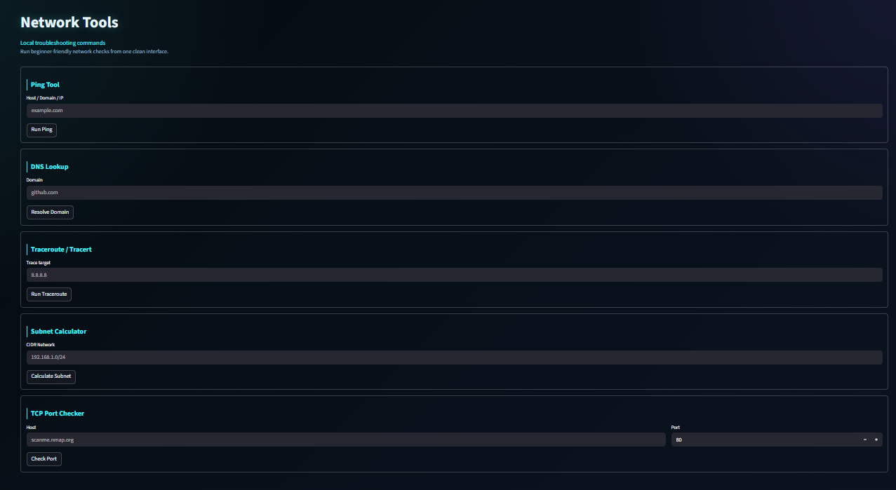
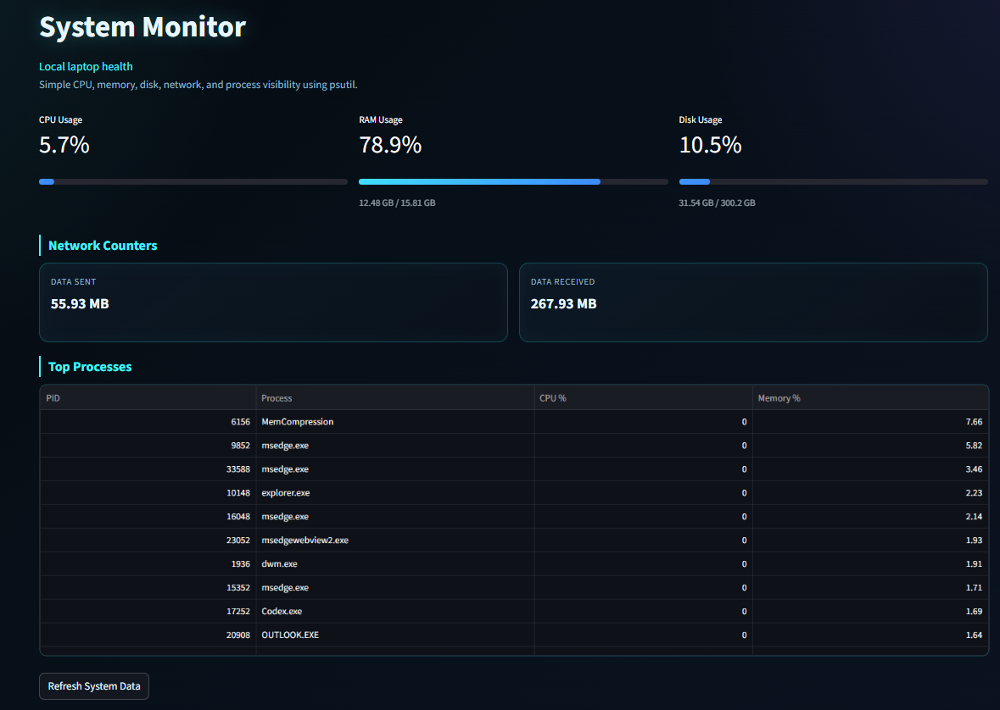
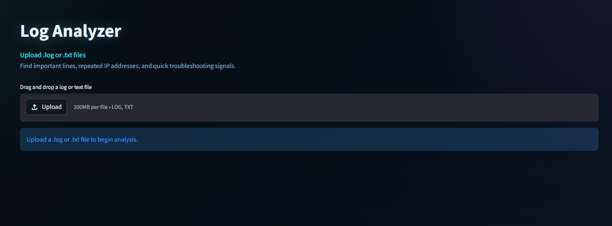

# Network Toolkit

### by mrachcore

<p align="center">
  
</p>

<p align="center">
  <b>Cyber-inspired local IT & network diagnostics toolkit built with Python and Streamlit.</b>
</p>

---

# 📌 Overview

Network Toolkit is a lightweight local IT/network utility dashboard created as part of my learning journey during my Ausbildung as a Fachinformatiker für Systemintegration.

The application combines:

* network troubleshooting tools
* system monitoring
* log analysis
* simple automation

inside a modern cyberpunk-inspired interface.

The project runs completely locally and does not require:

* paid APIs
* cloud services
* Docker
* databases
* external infrastructure

---

# ✨ Features

## 🖥 Dashboard

* System overview
* Hostname detection
* Local IP detection
* OS information
* Uptime display

---

## 🌐 Network Tools

* Ping tool
* DNS lookup
* Traceroute / Tracert
* Subnet calculator
* TCP port checker

---

## 📊 System Monitor

* CPU usage
* RAM usage
* Disk usage
* Network traffic stats
* Process viewer

---

## 📁 Log Analyzer

* Upload `.log` or `.txt` files
* Detect:

  * ERROR
  * WARNING
  * FAILED
  * DENIED
* Count events
* Extract common IP addresses
* Generate simple summaries

---

# 🛠 Tech Stack

| Technology | Purpose             |
| ---------- | ------------------- |
| Python     | Core language       |
| Streamlit  | Web UI              |
| psutil     | System monitoring   |
| socket     | Networking          |
| subprocess | System commands     |
| ipaddress  | Subnet calculations |

---

# 🎨 UI Design

The interface is inspired by:

* cybersecurity dashboards
* terminal interfaces
* network operations centers (NOC)
* cyberpunk aesthetics

### Design Highlights

* Dark mode only
* Neon cyan accents
* Responsive layout
* Terminal-style output
* Metric cards
* Modern sidebar navigation

---

# 🚀 Installation & Setup

## Requirements

* Python 3.10 or newer recommended
* A normal local laptop or desktop
* Internet access only for installing Python packages

---

## Setup

Open a terminal in the project folder:

```bash
cd network-toolkit
```

---

## Create a virtual environment

```bash
python -m venv .venv
```

---

## Activate the virtual environment

### Windows

```bash
.venv\Scripts\activate
```

### Linux/macOS

```bash
source .venv/bin/activate
```

---

## Install dependencies

```bash
pip install -r requirements.txt
```

---

# ▶ Run The App

```bash
streamlit run app.py
```

Streamlit will print a local URL, usually:

```text
http://localhost:8501
```

Open that URL in your browser.

---

# 📂 Project Structure

```text
network-toolkit/
│
├── app.py
├── requirements.txt
├── README.md
│
├── assets/
│   ├── logo.png
│   └── banner.png
│
├── screenshots/
│   ├── dashboard.png
│   ├── network-tools.png
│   ├── system-monitor.png
│   └── log-analyzer.png
│
└── utils/
    ├── network_tools.py
    ├── system_info.py
    └── log_analyzer.py
```

---

# 📸 Screenshots

## Dashboard



---

## Network Tools



---

## System Monitor



---

## Log Analyzer



---

# 🎯 Purpose of This Project

This project was built to:

* improve Python skills
* practice networking concepts
* learn troubleshooting workflows
* understand system monitoring
* create a professional portfolio project

---

# 📚 What I Learned

* Python scripting
* Streamlit UI development
* Networking basics
* System monitoring
* Log analysis
* Working with subprocesses
* Cross-platform command handling
* Project organization

---

# 🔮 Future Improvements

Possible future additions:

* packet sniffer
* live network scanner
* Docker monitoring
* export reports
* SSH tools
* multi-host monitoring
* theme customization

---

# 📝 Notes

* Ping and traceroute use local operating system commands.
* On Windows, traceroute uses `tracert`.
* On Linux/macOS, traceroute uses `traceroute`.
* If traceroute is missing on Linux/macOS, the app shows a friendly error message.
* Some process information may be hidden by the operating system.
* The application safely skips processes it cannot access.

---

# 👨‍💻 Author

### mrachcore

> Code. Connect. Control.

---

# 🌐 GitHub

Repository:

```text
https://github.com/mrachcore/networktoolkit
```

---

# ⚠ Disclaimer

This tool was created for educational and portfolio purposes.

Use responsibly and only on systems/networks you own or are authorized to test.
